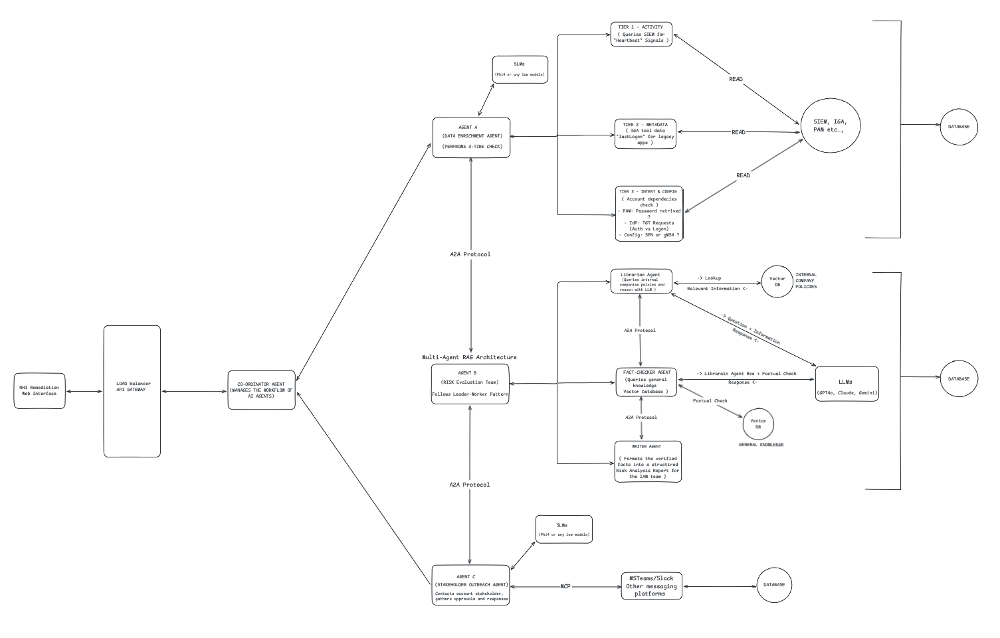

# NHI Remediation AI Agent System

[](https://opensource.org/licenses/MIT)
[](https://dotnet.microsoft.com/)
[](https://reactjs.org/)

> Autonomous multi-agent system for investigating and remediating orphaned/stale Non-Human Identity accounts across enterprise.

## 🎯 Overview

| Context|Description |
|----|----|
| **Problem** | IAM teams manually investigate 2,000+ service/generic accounts to keep the organization compliant. Growing adoption of AI agents adds overhead on top of this. |
| **Solution** | AI agents automate 80% of investigations and the system scales to handle 'n' number of future AI agents. |
| **Impact** | 99% cost reduction • 95% time savings |

---

## 🛡️ Safety & Governance (Human-in-the-Loop)

**Zero-Autonomous-Destruction Policy:**  
To prevent operational outages, this system is designed as a **Decision Support Tool**, not an autonomous executioner.

| Agent | Responsibility | Permissions |
|:------|:---------------|:------|
| **Agent A (Enrich)** | Gather technical facts & logs | **Read-Only** |
| **Agent B (Risk)** | Cite policy violations & assign Risk Score | **Read-Only** |
| **Agent C (Outreach)** | Negotiate with humans & capture business justification | **Read-Only** |
| **Human Admin** | Review the AI "Case File" & Click Approve/Reject | **Read/Write (Destructive)** |

**The "Case File" Approach:**  
The system's goal is to present a conflicting scenario (e.g., *Technical Risk* vs. *Business Need*) to the IAM Engineer in a single view, reducing investigation time from **4 hours** to **30 seconds**.

---

## 🏗️ High Level Design



*Multi-agent system with A2A Protocol orchestration: Agent A (3-Tier Enrichment), Agent B (Multi-Agent RAG), and Agent C (Stakeholder Outreach via MCP)*

---

## 📋 Requirements

### Functional

#### Agent A: Enrichment Agent (The 3-Tier Check)

**Task:** Determine account activity & ownership using a reliability hierarchy.

**Process:**
- **Tier 1 (Activity):** Query SIEM (Splunk/Sentinel) for "Heartbeat" signals (Event 4768, CloudTrail, SSH Logs)
- **Tier 2 (Metadata):** Fallback to IGA lastLogon attribute for legacy/non-integrated apps
- **Tier 3 (Intent & Config):** "Silent" usage check for dependencies:
  - PAM: Has password been retrieved recently?
  - IdP: Check for TGT requests (Authentication vs Logon)
  - Config: Is it an SPN or gMSA?

**Output:** Activity Confidence Level + Ownership Context  
**LLM:** Phi-4 (local)

---

#### Agent B: Risk Evaluation Team (Multi-Agent RAG)

**Task:** Autonomous, hallucination-free compliance auditing.

**Architecture:** Leader-Worker Pattern

| Agent | Role |
|-------|------|
| **Librarian** | Dedicated to querying the Vector Store. Breaks down account context ("Finance", "Privileged") into search terms and retrieves relevant policy chunks (ISO, NIST, Internal Standards). |
| **Fact-Checker** | A critical "Guardrail" agent. Takes the Librarian's chunks and cross-references them to ensure citations are real. |
| **Writer** | Formats the verified facts into a structured Risk Analysis Report for the Web Interface. |

**Output:** A cited, verified Risk Score (e.g., "Violation: Clause 4.2 of Policy X")  
**LLM:** GPT-4o (required for complex verification)

---

#### Agent C: Stakeholder Outreach Agent

**Task:** Contact stakeholders, gather approvals.

**Process:**
- Craft personalized Teams/Slack messages (e.g., "Your account X was last used by Service Y...")
- Track responses, handle escalations (7-day timeout)
- Update web interface with approval status

**LLM:** Phi-4 (local)

---

### Workflow

| Aspect | Implementation |
|--------|----------------|
| Batch Processing | 100 accounts/batch, 5 parallel instances |
| Partial Success | Failed accounts retry 3× (exponential backoff: 30s, 60s, 120s) |
| DLQ | Permanently failed → Dead Letter Queue → Manual review |
| IGA Integration | IGA workflow → SNOW ticket (audit trail) |

---

### Non-Functional

| Requirement | Implementation |
|-------------|----------------|
| Consistency | CAP theorem: Consistency > Availability (ACID via Azure SQL) |
| Scale | 1,000+ concurrent investigations, horizontal auto-scaling |
| Failover | Exponential backoff retry, circuit breakers |
| Security | Managed identities (no secrets), PII redaction before LLM |
| RBAC | Read-only vs Elevated permissions |
| Observability | Application Insights, health probes |
| Concurrency | Optimistic locking (version field in DB) |
| Orchestration | Event-driven pub/sub (Azure Service Bus) |

---

## 📊 Data Sources

### The 3-Tier Reliability Model (Agent A)

| Tier | Source | Logic | Use Case |
|------|--------|-------|----------|
| Tier 1 (Gold) | SIEM (Splunk/Sentinel) | "Is it active now?" | Live activity in AD, AWS, Unix, Entra ID |
| Tier 2 (Silver) | IGA | "When did we last see it?" | Legacy apps (SAP, Mainframe) where logs don't reach SIEM |
| Tier 3 (Bronze) | PAM + Directory | "Is it configured to run?" | Silent automations (Vault retrieval), Infrastructure (SPN) |

### Endpoint Support

| Platform | Log Source |
|----------|------------|
| Windows | Domain Controller Logs (Event 4768 TGT, 4776 NTLM) |
| UNIX/Linux | `/var/log/secure` or AD-Bridged logs |
| Cloud | AWS CloudTrail (AssumeRole), GCP Audit (GenerateAccessToken) |
| SaaS | Entra ID ServicePrincipalSignInLogs |

---

## 🔄 Data Flow

```
1. IAM team: "Investigate SAP - 500 accounts"
                    ↓
2. Coordinator: Divide into 5 batches × 100
                    ↓
3. Agent A (5 instances): Execute 3-Tier Analysis
   ├─ T1: Check SIEM for live logs (Active?)
   ├─ T2: Check IGA for lastLogon (Active?)
   ├─ T3: Check PAM/SPN/IdP Pulse (Intent?)
   └─ Result: 400 Active, 93 Orphan/Stale, 7 Fail
                    ↓
4. Agent A: Publish "agent_a_complete" events (×5)
                    ↓
5. Coordinator: Trigger Agent B (Risk Team)
                    ↓
6. Agent B Internal Workflow (Multi-Agent RAG):
   ├─ Librarian: Retrieves "Password Policy 2025" & "Service Account Standard"
   ├─ Fact-Checker: "Verification Pass: Policy requires 90-day rotation.
   │                  Account age is 400 days. CONFIRMED."
   └─ Writer: Generates formatted JSON for Web UI
                    ↓
7. Agent B: Publish "agent_b_complete" events
                    ↓
8. Coordinator: Trigger Agent C
                    ↓
9. Agent C (5 instances): Stakeholder outreach
   ├─ Send Teams messages with findings
   └─ Track approvals: 350 approved, 80 pending
                    ↓
10. IAM team: Approve 350 → Trigger IGA workflow
                    ↓
11. IGA: Disable accounts + Create SNOW tickets
```

---

## 🛠️ Technology Stack

| Layer | Technology |
|-------|------------|
| Orchestration | Microsoft Agent Framework (A2A protocol) |
| Backend | C# .NET 8 |
| Frontend | React 18 + Tailwind CSS |
| LLM | Phi-4 (local), GPT-4o, Claude Sonnet |
| Vector Store | Azure AI Search (Hybrid Search) |
| Agentic Framework | Semantic Kernel / Microsoft Agents |
| State | Azure SQL (Serverless) |
| Events | Azure Service Bus |
| Compute | Azure Kubernetes Service (Spot instances) |
| LLM Compute | Azure Container Instances (GPU, on-demand) |
| Monitoring | Application Insights |

---

## 💰 Cost Analysis

### Monthly Cost (2,000 accounts)

| Component | Cost |
|-----------|------|
| AKS (Spot Instances) | $315 |
| Azure SQL (Serverless) | $150 |
| Agent A (Phi-4 on-demand) | $16 |
| Agent B (GPT-4o API) | $85 |
| Agent C (Phi-4 on-demand) | $8 |
| Vector Store (Azure AI Search) | $75 |
| Service Bus | $10 |
| Storage & Monitoring | $5 |
| **Total** | **$664/month** |

---


**Author:** Nikesh  
**Version:** 1.0.0


